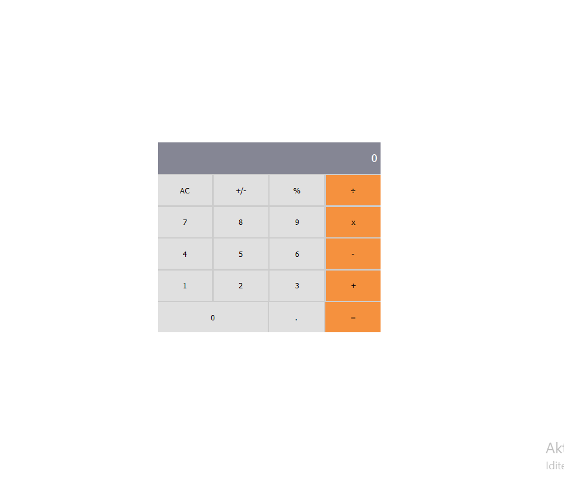

# Calculator App

> This is Calculator App.



Here you can calculate basic mathematical operations.

## Setup

### Clone this repository

```bash
$ git clone https://github.com/vladanvi99/math-magicians.git
$ cd math-magicians
```

### Run project

```bash
$ npm install
$ npm start
```

## Built With

- React
- Css

## Live Demo

- Heroku: https://math-magician-microverse.herokuapp.com/
- Netlifly: https://math-magican-microverse-360d8e.netlify.app/

## Authors

👤 **Vladan Videnović**

- GitHub: [@githubhandle](https://github.com/vladanvi99)
- Twitter: [@twitterhandle](https://twitter.com/vladanvi99)
- LinkedIn: [LinkedIn](https://www.linkedin.com/in/vladan-videnovi%C4%87-780bb11b2/)

## 🤝 Contributing

Contributions, issues, and feature requests are welcome!

Feel free to check the [issues page](../../issues/).

## Show your support

Give a ⭐️ if you like this project!


